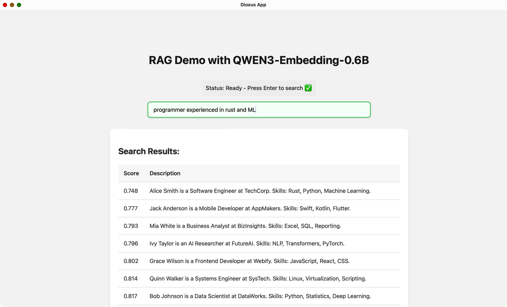

# RAG Demo with QWEN3-Embedding-0.6B


## Project Structure
```
text-embeddings-inference/
├── Cargo.toml           # Rust project manifest
├── src/                 # Source code
│   ├── main.rs          # App entry point
│   ├── lib.rs           # Shared library code
│   ├── embedder/        # QWEN3 embedder logic
│   │   ├── mod.rs
│   │   └── qwen3embedder.rs
│   ├── turso_db/        # Turso DB integration
│   │   ├── mod.rs
│   │   └── turso_db.rs
│   │   ├── data.db      # Database file
├── assets/              # Static assets (CSS, images)
│   ├── main.css
│   ├── favicon.ico
│   └── demo.png
├── README.md            # Project documentation
├── Dioxus.toml          # Dioxus config
├── clippy.toml          # Linting config
└── target/              # Build output
```

## Development Setup Guide

### Method 1) Using Dioxus CLI
> ##### Prerequisites
> - [Rust](https://www.rust-lang.org/tools/install)
> - [Dioxus-CLI](https://dioxuslabs.com/learn/0.6/getting_started/)
>
> ##### Run the App
> ```fish
> dx serve
> ```
> This will start the Dioxus desktop app. Open your browser or desktop window to interact with the RAG demo.

### Method 2) Using Cargo
> ##### Prerequisites
> - [Rust](https://www.rust-lang.org/tools/install)
> 
> ##### Run the App
> ```fish
> cargo run
> ```
> It is reccomended to use dioxus-cli, but if for any reason you can't use dioxus-cli's dx command, use cargo instead.

## Features
- **Retrieval-Augmented Generation (RAG):** Search and retrieve relevant information using text embeddings.
- **HuggingFace API Integration:** Integrated with the HuggingFace API so the code stays lean
- **QWEN3 Embedding Model:** Uses QWEN3-Embedding-0.6B for high-quality text embeddings. Cross-compatible with any of the Qwen3-Embedding models. 
- **Candle Backend:** Efficient inference engine for running QWEN3 models in Rust, locally, on the CPU.
- **Turso Database:** Fast, embedded SQLite-compatible database for storing and retrieving data. Native support for FTS5, vector search, etc.
- **Dioxus Frontend:** Modern, reactive desktop UI built with Dioxus for seamless user experience. Async integrated with std::sync::Arc and dioxus::spawn.
- **Semantic Search Results:** Results are ranked by cosine distance between query and database embeddings. Lower scores indicate higher similarity (more relevant results).
- **Live Demo:** Enter queries and instantly see the most relevant matches from the database, including their similarity scores and descriptions.

> [!NOTE]
> - ```hf_hub``` will save any models loaded to the huggingface cache folder by default, not the project folder. They will need to be deleted by clearning the cache, either through restarting the device, deleting the hugginface cache folder contents, or some other means.
> - The current model used, ```Qwen3-Embedding-0.6B```, takes up approximately 1.3GB space in the device cache.
> - ```Qwen3-Embedding-0.6B``` only has up to 1024 embedding dimentions with limited vocabulary, meaning it performs relatively well with english but lacks in other languages (tested with mandarin chinese and korean).
> - ```Qwen3-Embedding-0.6B``` is capable of semantic search, but its features seemed lacking. In terms of performance, there wasn't a meaningful difference between it and other small-sized models capable of non-semantic text embeddings.
> - ```Turso DB```, as a successor to Sqlite, holds the same issues as sqlite like having one global lock, getting outperformed past a few ten GB compared to dedicated client-server databases.

> [!Warning]
> - ```Turso DB``` and ```Dioxus``` still pre-release, so they are susceptable to unexpected behaviors.

---
For more details, see the source files in `src/`.
